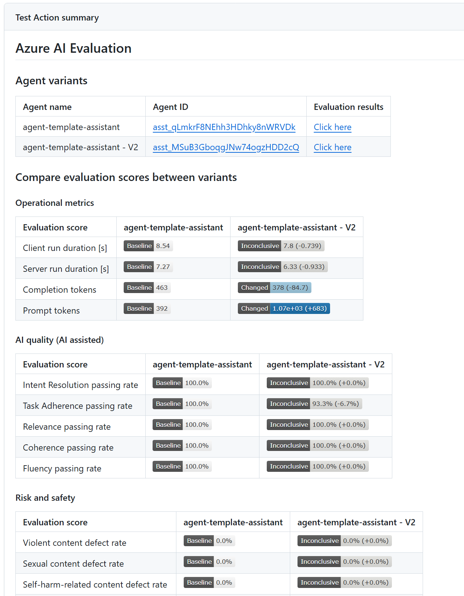

# AI Agent Evaluation

This extension enables offline evaluation of [Azure AI Agents](https://learn.microsoft.com/en-us/azure/ai-services/agents/)
within your Azure DevOps pipelines. It streamlines the evaluation process, allowing you to
identify potential issues and make improvements before releasing updates to production.

To use this extension, provide a data set with test queries and a list of evaluators.
It will invoke your agent(s) with the queries, collect performance data including latency
and token counts, run the evaluations, and generate a summary report.

## Features

- **Automated Agent Evaluation:** Integrate offline evaluation into your CI/CD workflows to automate the pre-production assessment of Azure AI Agents.
- **Built-in Evaluators:** Leverage existing evaluators provided by the
  [Azure AI Evaluation SDK](https://learn.microsoft.com/en-us/azure/ai-studio/how-to/develop/evaluate-sdk)
- **Seamless Integration:** Easily integrate with existing GitHub workflows to run evaluation based on rules that you specify in your workflows (e.g., when changes are committed to agent versions, prompt templates, or feature flag configuration).
- **Statistical Analysis:** Evaluation results include confidence intervals and test for statistical significance to determine if changes are meaningful and not due to random variation.
- **Out-of-box operation metrics:** Automatically generates operational metrics for each Evaluation run (Client run duration, server run duration, completion tokens and prompt tokens).

## Supported AI Evaluators

| Type                     | Evaluator                  |
| ------------------------ | -------------------------- |
| AI Quality (AI assisted) | IntentResolutionEvaluator  |
|                          | TaskAdherenceEvaluator     |
|                          | RelevanceEvaluator         |
|                          | CoherenceEvaluator         |
|                          | FluencyEvaluator           |
| Risk and safety          | ViolenceEvaluator          |
|                          | SexualEvaluator            |
|                          | SelfHarmEvaluator          |
|                          | HateUnfairnessEvaluator    |
|                          | IndirectAttackEvaluator    |
|                          | ProtectedMaterialEvaluator |
|                          | CodeVulnerabilityEvaluator |
| Composite                | ContentSafetyEvaluator     |

## Getting Started

### Task Parameters

| Name                      | Required | Description                                                                                                                                                                                                                                           |
| ------------------------- | :------: | ----------------------------------------------------------------------------------------------------------------------------------------------------------------------------------------------------------------------------------------------------- |
| azure-ai-project-endpoint |   Yes    | Endpoint of your Azure AI Project                                                                                                                                                                                                                     |
| deployment-name           |   Yes    | The name of the Azure AI model deployment to use for evaluation                                                                                                                                                                                       |
| data-path                 |   Yes    | Path to the data file that contains the evaluators and input queries for evaluations                                                                                                                                                                  |
| agent-ids                 |   Yes    | ID of the agent(s) to evaluate. If multiple are provided, all agents will be evaluated and compared against the baseline with statistical test results                                                                                                |
| baseline-agent-id         |    No    | ID of the baseline agent to compare against when evaluating multiple agents. If not provided, the first agent is used                                                                                                                                 |
| evaluation-result-view    |    No    | Specifies the format of evaluation results. Defaults to "default" (boolean scores such as passing and defect rates) if omitted. Options are "default", "all-scores" (includes all evaluation scores), and "raw-scores-only" (non-boolean scores only) |
| api-version               |    No    | The API version to use when connecting to model deployment                                                                                                                                                                                            |

### Data File Format

The input data file should be a JSON file with the following structure:

```json
{
  "name": "test-data",
  "evaluators": ["IntentResolutionEvaluator", "FluencyEvaluator"],
  "data": [
    {
      "query": "Tell me about Smart eyeware"
    },
    {
      "query": "How do I rebase my branch in git?"
    }
  ]
}
```

### Azure Pipeline Example

```yaml
steps:
  - task: AIAgentEvaluation@2
    displayName: "Evaluate AI Agents"
    inputs:
      azure-ai-project-endpoint: "$(AzureAIProjectEndpoint)"
      deployment-name: "$(DeploymentName)"
      data-path: "$(System.DefaultWorkingDirectory)/path/to/your/dataset.json"
      agent-ids: "$(AgentIds)"
```

## Evaluation Results

Evaluation results will appear in the Azure DevOps pipeline summary with detailed metrics
and comparisons between agents when multiple are evaluated.


